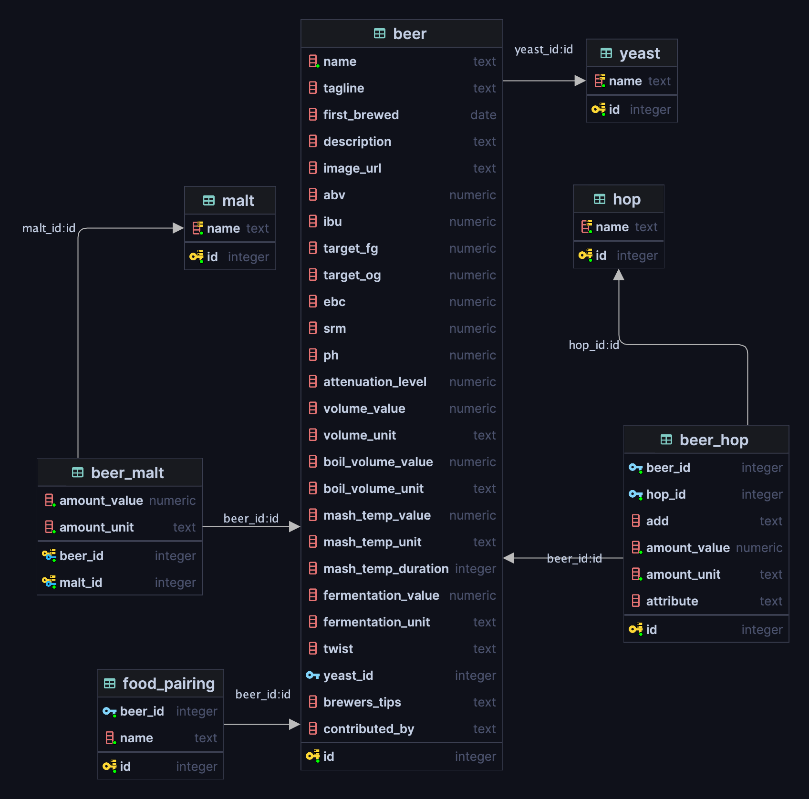

# Punk API

This is a replication of [Punk api](https://punkapi.com/). 

It's function is to provide details about the Brewdog's collection of beers as documented in the DIY Dog document.

The application is consisted of a REST api developed with Spring Boot using Java21 and a PostgreSQL database to host the necessary data.


In order to run the application you need:

1. JDK21
2. Docker

### Run Instructions
 
1. Run the following command to start a container with the PostgreSQL database. The file [schema.sql](src/main/resources/schema.sql) will be mounted on start up which will be used to create the schema.
```sh
docker compose up
```

2. Run the application with the following command 
```sh
./mvnw spring-boot:run
```
The application will run by default on port 8080

3. Run the following script to persist data in the Database
```sh
chmod +x populate-data.sh
./populate-data.sh
```
This script loops through the json files containing all the beer data from punk api and sends them to the Spring Boot application through a PUT request in order to be persisted. 
The files can be found on the Punk api repo [here](https://github.com/sammdec/punkapi/tree/master/data).

### Endpoints

The endpoints of the REST api are the following:
1. `GET localhost:8080/api/v1/beers`
   - Queries for all beers in the database
2. `GET localhost:8080/api/v2/beers`
   - Queries for a page of beers
   - Pagination is handled by the query parameters `size` which defaults is 10 and `page` which defaults to 0
   - Additional optional query parameters include:
     - `name` used for fuzzy search of beer names
     - `year` used to search for when the beer was first brewed
     - `food` used for fuzzy search of food pairings
     - `malt` used for fuzzy search of malts
     - `hop`  used for fuzzy search of hops
     - `yeast` used for fuzzy search of yeasts
3. `GET localhost:8080/api/v2/beer/random`
   -  Queries for a random beer
4. `PUT localhost:8080/api/(v1|v2)/beer`
    -  Persists a beer in the database


### Improvements

Due to time constraints, I was not able to add all the functionalities I had in mind. Those include:

- Swagger documentation
- More integration tests of the last requirements
- Unit tests
- Adjustable configurations for deploying the application on different environments
- Javadoc
- Docker configuration for deploying the app
- Investigation if using trigrams in Postgres will provide better results for fuzzy searches
- Investigation to check if food pairings need to be normalized
- The ability to query by multiple malts and hops


### Database Schema
The database schema is designed as follows:

